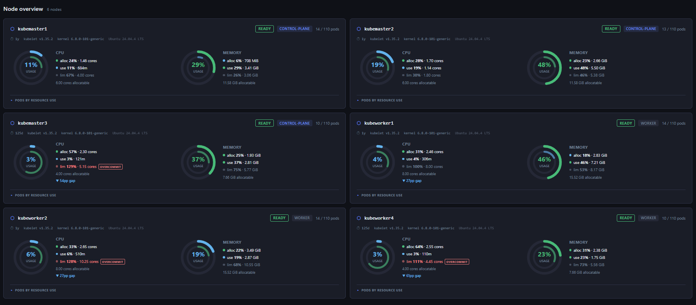

# KubeAdjust

> Lightweight Kubernetes resource dashboard — visualise requests, limits and live usage per workload, pod and container, with actionable right-sizing suggestions.

[](LICENSE)
[](https://golang.org/)
[](https://nextjs.org/)

---



> **Solo project** — KubeAdjust is a personal tool I built to scratch my own itch and decided to open source.
> It is maintained by a single developer in spare time, with the help of an AI coding agent.
> Expect rough edges, and feel free to open issues or PRs — contributions are welcome but response times may vary.

---

## What is KubeAdjust?

KubeAdjust is a read-only Kubernetes dashboard focused on **resource efficiency**. It shows, for every Deployment, StatefulSet and CronJob in a namespace:

- CPU and memory **requests / limits / actual usage** side-by-side
- Color-coded status: Critical / Warning / Over-provisioned / Healthy
- Ephemeral storage and PVC usage
- **Suggestions panel** — grouped by resource type (CPU, Memory, Ephemeral, PVC) with concrete reduce/increase recommendations
- Optional **CPU/memory sparklines** from an existing Prometheus
- Node overview (capacity, allocatable, requested, usage)

No persistence, no write access to your cluster. Everything is fetched on-the-fly.

## Architecture

```
Browser
  └── Next.js frontend  (port 3000)
        └── /api/* rewrite → Go backend  (port 8080)
                              ├── Kubernetes API  (deployments, pods, namespaces)
                              ├── metrics-server  (live CPU/memory)
                              └── Prometheus      (optional — sparklines)
```

**Stateless by design.** Every page refresh triggers fresh HTTP calls. Nothing is stored or cached in the backend.

## Quick start

### Option 1 — Docker Compose (recommended)

```bash
git clone https://github.com/thomas6013/devops-kubeadjust.git
cd devops-kubeadjust

# Point to your cluster
export KUBE_API_SERVER=https://<your-cluster-api>
export KUBE_INSECURE_TLS=true   # if self-signed cert

docker compose up --build
```

Open http://localhost:3000, paste a service account token, done.

> **No cluster?** Use token `mock-dev-token` to explore the UI with hardcoded demo data.

### Option 2 — Local dev

```bash
# Backend (requires Go 1.22+)
cd backend
KUBE_API_SERVER=https://<your-cluster> KUBE_INSECURE_TLS=true go run .

# Frontend (requires Node 20+)
cd frontend
npm install && npm run dev
```

### Option 3 — Helm

```bash
# Add the metrics-server repo if not already present
helm repo add metrics-server https://kubernetes-sigs.github.io/metrics-server/

# Install KubeAdjust
helm install kubeadjust ./helm/kubeadjust \
  --namespace kubeadjust --create-namespace \
  --set backend.image.repository=ghcr.io/thomas6013/devops-kubeadjust/kubeadjust-backend \
  --set frontend.image.repository=ghcr.io/thomas6013/devops-kubeadjust/kubeadjust-frontend \
  --set ingress.enabled=true \
  --set ingress.host=kubeadjust.your-domain.com
```

Get a login token after install:

```bash
kubectl create token kubeadjust -n kubeadjust
```

## Configuration

### Backend environment variables

| Variable | Default | Description |
|---|---|---|
| `KUBE_API_SERVER` | `https://kubernetes.default.svc` | Kubernetes API server URL |
| `KUBE_INSECURE_TLS` | `false` | Skip TLS verification (useful for self-signed certs) |
| `PROMETHEUS_URL` | _(empty)_ | Prometheus base URL for sparklines (optional) |
| `PORT` | `8080` | Backend listen port |

### Optional: Prometheus sparklines

Set `PROMETHEUS_URL` to connect KubeAdjust to an existing Prometheus. When configured, each container row shows a 1-hour CPU and memory trend.

```bash
# Docker Compose
PROMETHEUS_URL=http://prometheus:9090 docker compose up

# Helm
helm upgrade kubeadjust ./helm/kubeadjust \
  --set prometheus.enabled=true \
  --set prometheus.url=http://prometheus-operated.monitoring.svc:9090
```

### Optional: deploy metrics-server via Helm

If your cluster does not have metrics-server, you can deploy it as a sub-chart:

```bash
helm dependency update ./helm/kubeadjust

helm install kubeadjust ./helm/kubeadjust \
  --set metricsServer.enabled=true
```

## Auth model

KubeAdjust uses the same authentication pattern as the official Kubernetes dashboard:

1. The user pastes a **service account token** in the login UI
2. The token is stored in `sessionStorage` (cleared on tab close, never sent to a server other than your cluster)
3. Every API call forwards `Authorization: Bearer <token>` directly to the Kubernetes API — KubeAdjust never validates or stores it

## RBAC

The Helm chart creates a `ClusterRole` with **read-only** access:

```yaml
rules:
  - apiGroups: [""]
    resources: ["namespaces", "pods", "persistentvolumeclaims", "nodes"]
    verbs: [get, list, watch]
  - apiGroups: ["apps"]
    resources: ["deployments", "replicasets", "statefulsets"]
    verbs: [get, list, watch]
  - apiGroups: ["batch"]
    resources: ["cronjobs", "jobs"]
    verbs: [get, list, watch]
  - apiGroups: ["metrics.k8s.io"]
    resources: ["pods", "nodes"]
    verbs: [get, list]
```

Bind the role to a user or group:

```bash
kubectl create clusterrolebinding my-user-kubeadjust \
  --clusterrole=kubeadjust-viewer \
  --user=my@user.com
```

## Stack

| Layer | Tech |
|---|---|
| Backend | Go 1.22+, chi router, no client-go |
| Frontend | Next.js 14, TypeScript, CSS Modules |
| Deploy | Helm chart, multi-stage Docker builds |

## Contributing

See [CONTRIBUTING.md](CONTRIBUTING.md).

## License

Apache 2.0 — see [LICENSE](LICENSE).
