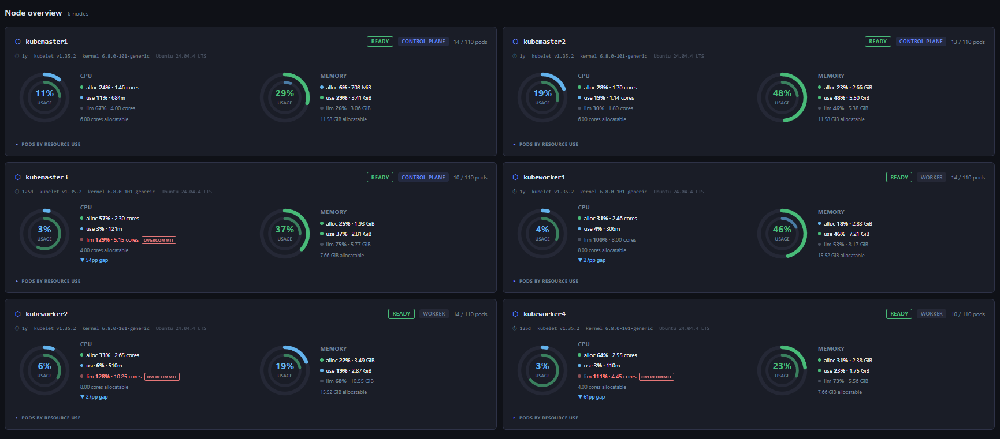

# KubeAdjust

> See what your Kubernetes workloads actually use vs what they request — and get suggestions to right-size them.

[](LICENSE)
[](https://golang.org/)
[](https://nextjs.org/)
[](https://kubernetes.io/)

---



> **Alpha software** — This is a personal project, maintained by a single developer with the help of an AI coding agent. Expect rough edges. Contributions welcome, response times may vary.

> **Read-only** — KubeAdjust never modifies your cluster. It only reads resource data. If you apply the suggestions manually, be aware that changing requests/limits on a running Pod triggers a **restart**.

---

## Why?

Most clusters waste resources because requests and limits are set once and never revisited.

**Before KubeAdjust:** your Pod requests 2Gi memory, but only uses 180Mi. You don't know — it just runs.

**After KubeAdjust:** you see the over-provisioning instantly, with a concrete suggestion: _"Reduce memory request to 256Mi (current P95: 195Mi)"_.

KubeAdjust shows for every Deployment, StatefulSet and CronJob:
- CPU and memory **requests / limits / actual usage** side-by-side
- Color-coded status (critical / warning / over-provisioned / healthy)
- Actionable **right-sizing suggestions** with confidence levels
- Optional **sparklines** from Prometheus (1h to 7d trends)
- Cluster-wide **node overview** with capacity, usage, limit overcommit indicator, node conditions (DiskPressure / MemoryPressure / PIDPressure), age, kubelet version, kernel, and OS image
- **Namespace limit/request ratios** — CPU ×N.N and MEM ×N.N at a glance above the workload list
- **Multi-cluster support** — configure multiple clusters via `CLUSTERS` env var; tokens are stored per cluster so switching between visited clusters requires no re-authentication
- **OIDC / SSO authentication** — optional SSO login via Keycloak, Dex, Google, or any OIDC provider. Works on managed clusters (EKS, GKE, AKS) with no K8s API server configuration required

---

## Requirements

| Requirement | Minimum version |
|---|---|
| Kubernetes | **1.21** (`batch/v1` CronJobs) |
| metrics-server | any (optional, enables live usage) |
| Prometheus | any (optional, enables sparklines + P95) |
| Go | 1.22+ (build only) |
| Node.js | 20+ (build only) |

---

## Install

### Helm (production)

```bash
helm install kubeadjust ./helm/kubeadjust \
  --namespace kubeadjust --create-namespace \
  --set backend.image.repository=ghcr.io/thomas6013/kubeadjust/kubeadjust-backend \
  --set frontend.image.repository=ghcr.io/thomas6013/kubeadjust/kubeadjust-frontend \
  --set ingress.enabled=true \
  --set ingress.host=kubeadjust.your-domain.com
```

Get a login token:

```bash
kubectl create token kubeadjust -n kubeadjust
```

### Docker Compose (local)

```bash
git clone https://github.com/thomas6013/kubeadjust.git && cd kubeadjust

export KUBE_API_SERVER=https://<your-cluster-api>
export KUBE_INSECURE_TLS=true   # if self-signed cert

docker compose up --build
```

Open http://localhost:3000, paste your token, done.

### Local dev

```bash
# Backend (Go 1.22+)
cd backend && KUBE_API_SERVER=https://<your-cluster> go run .

# Frontend (Node 20+)
cd frontend && npm install && npm run dev
```

---

## Configuration

| Variable | Default | Description |
|---|---|---|
| `KUBE_API_SERVER` | `https://kubernetes.default.svc` | Kubernetes API URL |
| `KUBE_INSECURE_TLS` | `false` | Skip TLS verification |
| `PROMETHEUS_URL` | _(empty)_ | Prometheus URL for sparklines (optional) |
| `ALLOWED_ORIGINS` | `*` | CORS origins (comma-separated) |
| `PORT` | `8080` | Backend listen port |
| `OIDC_ENABLED` | `false` | Enable OIDC/SSO login |
| `OIDC_ISSUER_URL` | _(empty)_ | OIDC provider issuer URL |
| `OIDC_CLIENT_ID` | _(empty)_ | OIDC client ID |
| `OIDC_CLIENT_SECRET` | _(empty)_ | OIDC client secret |
| `OIDC_REDIRECT_URL` | _(empty)_ | `https://<host>/auth/callback` |
| `SESSION_SECRET` | _(empty)_ | ≥32-char random string for signing session tokens |
| `SA_TOKEN_<CLUSTER>` | _(empty)_ | SA token for a named cluster, e.g. `SA_TOKEN_PROD` (OIDC multi-cluster) |
| `SA_TOKEN` | _(empty)_ | SA token override for the default cluster (normally not needed — uses in-cluster token) |

**Prometheus:** set `PROMETHEUS_URL` to enable sparklines and P95-based suggestions. Works with or without `http://` prefix.

**metrics-server:** required for live usage data. If not installed, enable the sub-chart: `--set metrics-server.enabled=true`.

**Multi-cluster:** configure clusters as a Helm map (`backend.clusters.prod`, `backend.clusters.staging`, …). Each cluster stores its token independently in sessionStorage — switching between clusters requires no re-authentication.

**OIDC / SSO:** see [docs/oidc.md](docs/oidc.md) for a full setup guide. Works with any OIDC provider and on managed clusters (EKS, GKE, AKS) — no K8s API server configuration required.

---

## Architecture

```
Browser → Next.js (port 3000) → /api/* proxy → Go backend (port 8080)
                                                  ├── Kubernetes API
                                                  ├── metrics-server
                                                  └── Prometheus (optional)
```

**Token mode (default):** stateless — no database, no cache. Your K8s token is forwarded on every request, never stored server-side.

**OIDC mode:** the backend validates the OIDC ID token and issues a signed session JWT. A pre-configured Service Account token is used for all K8s API calls.

---

## Security

- **Read-only RBAC** — the Helm ClusterRole only has `get`, `list`, `watch` permissions
- **Token in sessionStorage** — cleared on tab close, never logged or persisted
- **PromQL injection prevention** — strict whitelist validation on all label values
- **10MB response cap** — `io.LimitReader` on all upstream responses
- **CSP + security headers** — configured in Next.js

---

## Contributing

See [CONTRIBUTING.md](CONTRIBUTING.md).

## License

Apache 2.0 — see [LICENSE](LICENSE).
